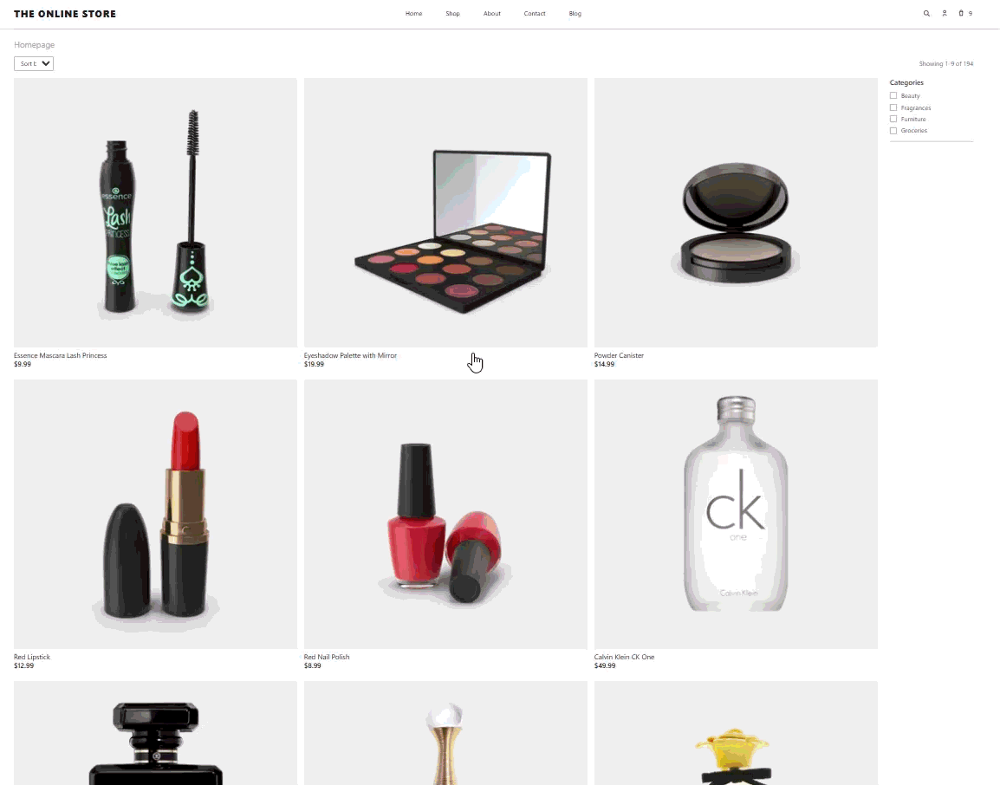

# 🛍️ LTP Labs Frontend Assessment — Simple Online Store

A modern e-commerce frontend built with **React Router v7**, implementing server-driven data flows, URL-based state, and a production-ready architecture inspired by Remix patterns.

🔗 **Repository**  
https://github.com/AdrianaAC/frontend-assessment-LTPLabs

---

## 📌 Overview

This project implements a **simple online store** based on the provided challenge and Figma design.

It includes:

- Product listing with filtering, sorting, and pagination
- Product detail page with add-to-cart functionality
- Persistent shopping cart (cookie-based)
- Responsive UI following the provided design
- Server-driven data loading using route loaders/actions

---

## 🧠 Architectural Approach

Although the challenge requested **Remix**, this implementation uses **React Router v7**.

> 💡 **Why?**
>
> React Router v7 is the evolution of Remix and shares the same core concepts:
>
> - Route modules
> - Loaders & actions
> - Server-first data fetching
> - Nested routing architecture

This allowed the implementation of the **same architectural patterns expected in Remix**, while using a lighter and more flexible setup.

👉 The goal was to demonstrate:

- Understanding of **server-driven UI**
- **URL as the source of truth**
- Clear separation between data and presentation
- Scalable routing architecture

---

## ⚙️ Tech Stack

- **React Router v7**
- **TypeScript**
- **Vite**
- **CSS (custom, no UI frameworks)**
- **Cookie-based persistence (cart state)**

---

## 🚀 Features

### 🏠 Homepage

- Product listing from API
- Category filtering (as defined in Figma)
- Sorting (price / title)
- Pagination
- URL-driven state (`?page=`, `?sort=`, `?category=`)
- Responsive layout

---

### 📦 Product Detail Page

- Product information (title, price, description, image)
- Add to cart
- Server-side form handling via action
- Layout aligned with Figma design

---

### 🛒 Shopping Cart (Optional Feature Implemented)

- Add/remove items
- Quantity updates
- Subtotal / shipping / total calculation
- Persistent cart using cookies
- Accessible via header icon

---

### 🧩 Routing & Data Flow

- Route-based data loading (loaders)
- Server-side mutations (actions)
- URL-driven UI state
- Clean separation of concerns

---

## 🎨 Design Implementation

The UI was built based on the provided Figma design.

- Layout structure follows the design system
- Spacing, typography, and hierarchy respected
- Responsive behavior implemented for different screen sizes
- Category visibility matches the design specification

---

## 📸 Demo



---

## 📂 Project Structure

```
app/
  components/
    Header.tsx
    ProductCard.tsx
    CategorySidebar.tsx
    Pagination.tsx

  routes/
    home.tsx
    product-detail.tsx
    cart.tsx

  lib/
    cart.ts
    products.ts
    url.ts

  app.css
```

---

## ⚖️ Trade-offs & Decisions

### React Router v7 vs Remix

- Chose React Router v7 to leverage the same architectural model
- Maintains loaders/actions and server-driven flows
- Demonstrates understanding of modern routing paradigms

---

### UI Scope

- Focused on **core challenge requirements**
- Additional pages (e.g. About, Blog) are placeholders and not part of the core scope
- Priority given to **completeness of main flows**

---

### State Management

- No global state libraries used
- URL + server + cookies = single source of truth
- Keeps the architecture simple and scalable

---

## 🧪 How to Run

```bash
npm install
npm run dev
```

Then open:

http://localhost:5173

---

## ✅ Compliance with Challenge Requirements

| Requirement               | Status |
| ------------------------- | ------ |
| Product listing           | ✅     |
| Product detail page       | ✅     |
| Sorting                   | ✅     |
| Category filtering        | ✅     |
| Pagination                | ✅     |
| Add to cart               | ✅     |
| Cart page (optional)      | ✅     |
| Responsive design         | ✅     |
| Server-side data handling | ✅     |
| Figma-based UI            | ✅     |

---

## 🧠 Final Notes

This project was built with a strong focus on:

- Clean architecture
- Scalability
- Server-driven UI patterns
- Real-world frontend practices

Rather than only meeting the minimum requirements, the goal was to deliver a solution that reflects how a production-grade frontend application would be structured.

---

## 🙌 Thank You

Thank you for the opportunity to work on this challenge — it was a great exercise in balancing **UX, architecture, and product thinking**.
